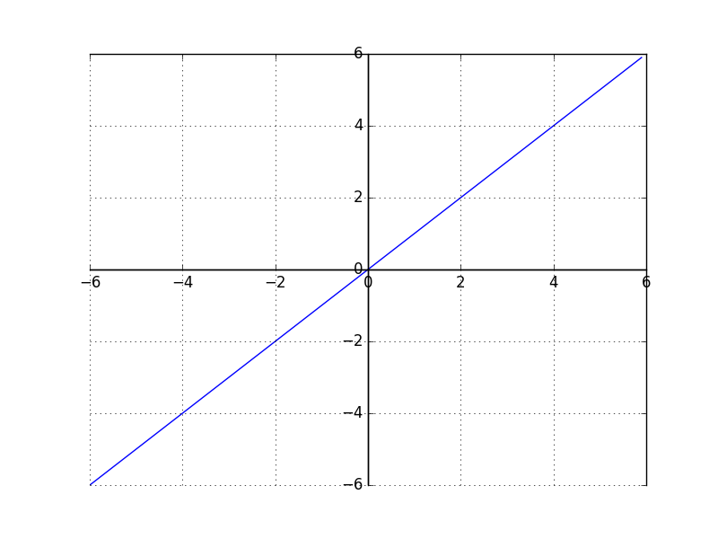

## Mémo Python

### Python

Le mot clé `yield` permet de construire un générateur.
```python
def gen(liste):
	for ele in string:
		yield ele
```
Qu'on peut utiliser:
```python
for ele in gen("foobar"):
	print(ele)
```

En utilisant la syntaxe ```with```, on délègue la responsabilité de la fermeture du fichier. En effet, dès qu'on sort du bloc, la ressource est supprimée:
```python

with open("bla.dat", 'r') as f:
	for line in f.readlines():
		print(line)
```
On peut également créer sa propre classe à utiliser avec ```with```:
```Python
class foo:
	
	def __init__(self, attr1, attr2, attr3):
		self.attr1 = attr1
		self.attr2 = attr2
		self.attr3 = attr3
		
	def __enter__(self):
		self.attr1.open(self.attr2, self.attr3)
	
	def __exit__(self):
		self.attr1.close()
```
La méthode ```__enter__``` est appellée en entrée du bloc ```with```. La méthode ```__exit__``` en sortie.

Vu que les fonctions peuvent être passées comme attributs, il est possible de créer des décorateurs facilement:
```python
import time

def timer(func):
	t = time.process_time()
	func()
	print("Temps écoulé : " + str(time.process_time() - t))
	
@timer
def slooooooow():
	for ele in range(1000):
		x = 1000
		while(x > 0):
			x -= 1

slooooooow() 
# => Temps écoulé : 0.09051611200000131
```

### IPython
Utilisation de ```pylab```:
```bash
ipython3 --pylab
```

Lancement d'un script depuis le shell:
```python
In [1]: %run mon_script.py
```

Recharger une lib après l'avoir modifier:
```python
reload(my_lib)
```

Calculer le temps d'exécution d'une instruction:
```python
x = 'folder'
y = 'fol'

%timeit x.startswith(y) # = 1000000 loops, best of 3: 210 ns per loop

%timeit x[3:] == y # 1000000 loops, best of 3: 184 ns per loop
```
On remarque que la deuxième solution est en moyenne meilleure.

### Numpy
Somme d'un tableau de booléen:
```python
tab = [True, True, True, False, True, False]
np.sum(tab) # = 4
```

Change le type d'un ```array``` si possible:
```python
array = np.array(["4.5","3.4","3"]) # 	= array(['4.5', '3.4', '3'], dtype='<U3')
array.astype(np.float64) # 				= array([ 4.5,  3.4,  3. ])
```

Utilisation de condition avec ```np.where```
```python
array = np.random.rand(3,3)
#array([[ 0.71406375,  0.74411441,  0.16653242],
#     	[ 0.56306589,  0.14198397,  0.4568308 ],
#      	[ 0.01144967,  0.24321215,  0.39831054]])

np.where(array > 0.5, 1, 0)
#array([[1, 1, 0],
#      	[1, 0, 0],
#       [0, 0, 0]])

np.where(array > 0.5, 1, array)
#array([[ 1.        ,  1.        ,  0.16653242],
#       [ 1.        ,  0.14198397,  0.4568308 ],
#      [ 0.01144967,  0.24321215,  0.39831054]])
```

### Panda
Il est possible d'utiliser panda pour faire du traitement de donnés lourd.
On peut charger un fichier :
```
1,2,3
4,5,6
7,8,9
```
s'appellant `data.dat`:
```python
data = pandas.read_csv("data.dat",header=None)
#    0  1  2 
# 0  1  2  3 
# 1  4  5  6
# 2  7  8  9 

data[0][0] #=> 0
data[2][2] #=> 9
data[0] #=> 0    1
#        => 1    4
#        => 2    7
# Name: 0, dtype: int64
```
Malheureusement cela ne semble par pratique, sauf si on applique:
```python
np.squeeze(np.matrix(data))
#  matrix([[1,  2,  3 ],
#  [4,  5,  6],
#  [7,  8,  9]]) 
```
Qui est bien plus agréable, on utilise le ```np.squeeze```, pour virer les dimensions inutiles.

### Matplotlib
On peut ajouter du code **Latex** dans les axes et les légendes:
```python
import matplotlib.pyplot as plt
import numpy as np

m = np.random.rand(10,10)

plt.imshow(m)
plt.xlabel("valeur $x$")
plt.ylabel("valeur $y$")
plt.title("Exemple avec $m_{ij} \in [0,1[ \ \forall i,j$")
plt.show()
```

Donne :


Pour centrer les axes:
```python
t2 = np.arange(-6,0,0.1)
t = np.arange(0,6,0.1)
res = np.append(t2,t)

fig, ax = plt.subplots()
ax.grid()
ax.plot(res,res)
ax.axhline(y=0, color='k')
ax.axvline(x=0, color='k')
ax.spines['left'].set_position('zero')
ax.spines['bottom'].set_position('zero')
plt.show()
```



### Performances
Pour concaténer des ```string```:
```python
strings = [str(ele) for ele in ["hello", " world", " my", " my", " name", " is", " Romain"]
res = "".join(strings) # res = "hello my my name is Romain"
```

Utilisations de ```Counter``` pour compter des mots, avec réutilisation de ``res``:
```python
from collections import Counter
import re

dict = Counter(re.findall('\w+', strings))
# dict = {"hello": 1, "world": 1, "my":2 ...
```

Décorateur pour cacher les résultats; si le résultat d'un élément est déjà connu, il ne sera pas recalculé:
```python
@lru_cache(maxsize=32)
def fac(x):
	res = 1
	for ele in range(x):
		res *= ele
	return res
```
On obtient :
```python
%time x = fact(40000)
CPU times: user 708 ms, sys: 565 µs, total: 709 ms
Wall time: 710 ms
```
puis:
```
%time x = fact(40000)
CPU times: user 8 µs, sys: 1 µs, total: 9 µs
Wall time: 13.6 µs
```

Boucle création  et compte d'un dictionnaire:
```python
for key in dictionnary:
#try except if more fast than if-then
	try:
            dictionnary[key] += 1
	except KeyError:
            dictionnary[key] = 0
```

Profiler son code:
- ajouter dans son fichier ```import cProfile```
- lancer le script avec ```python3 -m cProfile tp3.py | grep "tp3.py" > cProfile.txt```

Voici un exemple de fichier:

```
   ncalls  tottime  percall  cumtime  percall filename:lineno(function)

    53804    7.758    0.000    7.765    0.000 tp3.py:25(energie)
        1    0.000    0.000    8.507    8.507 tp3.py:4(<module>)
        2    0.000    0.000    0.000    0.000 tp3.py:41(generation_solution)
    26952    0.129    0.000    0.444    0.000 tp3.py:49(generation_voisins)
        1    0.000    0.000    0.018    0.018 tp3.py:70(temperature_initiale)
        1    0.000    0.000    0.001    0.001 tp3.py:9(chargement_villes)
    26852    0.096    0.000    7.862    0.000 tp3.py:90(test_acceptation)
```
   
Profiler une fonction:
- il faut : ```pip3 line_profiler```
- ajouter dans le fichier ```import line_profiler```
- ajouter un décorateur ```@profile``` en dessus de la fonction à profiler
- lancer le script avec ```kernprof -l -v mon_script.py```

Voici un exemple de sortie:

    0         Line     Hits  Time  Per Hit   % Time  Line Contents

    11                                           @profile
    12                                           def compute_prior(folder):
    13                                               """
    14                                               Given a folder, we compute the prior of neg and pos
    15                                               folder = "./movie-reviews-en/train/"
    16                                               """
    17                                               # we compute the number of positive reviews
    18         3         1719    573.0     52.9      number_positive = len([f for f in listdir(folder + "pos/")])
    19                                               # then the negative
    20         3         1512    504.0     46.6      number_negative = len([f for f in listdir(folder + "neg/")])
    21                                               # we add it and we have the total
    22         3            6      2.0      0.2      total = number_positive + number_negative
    23                                               # we devide to have the probabilites
    24         3            6      2.0      0.2      number_positive /= total
    25         3            1      0.3      0.0      number_negative /= total
    26                                               # we return this three numbers
    27         3            3      1.0      0.1      return [number_positive, number_negative, total]

Il est intéressant d'éviter l'appel de méthode lors de boucle. Pour éviter ce point on peut:
```python
upper = str.upper
newlist = []
append = newlist.append
for word in oldlist:
    append(upper(word))
```

### Appeler des fonctions en C/C++

1) En premier lieu, il faudra écrire vos fonctions `C/C++`, dans une librairie. Exemple de lib:

```Cpp
#include <iostream>
#include <vector>
#include <tgmath.h>

using namespace std;

extern "C" {
	void norm(const float* array, int len){
		int n = 2*len;
		flaot res = 0.0;
		for(int i=2; i < n; i+= 2){
			res += sqrt(pow(array[i-2] - array[i],2) + pow(array[i-1]-array[i+1],2));	
		}
		res += sqrt(pow(array[n-2] - array[0],2) + pow(array[n-1]-array[1],2));	
	}
	return res;
}
```

Cette fonction est contenue dans `norm.cpp`.

2) Compilation de la lib:
```bash
g++ -o libnormcpp.so norm.cpp -fPIC -shared
```

3) Code Python pour l'appeler:
```python
# première ligne, on charge la lib
lib = ctypes.cdll.LoadLibrary('./libnormcpp.so')

# on définit les arguments de la fonction norm contenue dans lib
lib.norm.argtypes = [ndpointer(ctypes.c_float, flags="C_CONTIGUOUS"), ctypes.c_int]

#valeure de retour 
lib.norm.restype = ctypes.c_float

# on change le type de la solution pour qu'elle corresponde à la ligne du dessus
sol = np.array(solution, dtype=np.float32)

# on appelle la fonction avec la pramètres
return lib.norm(sol, len(solution))

```

Il n'est pas possible de changer le tableau _numpy_ en un double pointeur.

### Lien
[PythonSpeed/PerformanceTips](https://wiki.python.org/moin/PythonSpeed/PerformanceTips) -> pour tout ce qui concerne les aspects de performances.

[Documentation _ctypes_](https://docs.python.org/3/library/ctypes.html) -> pour inclure du code `C/C++`.

[Documentation _cProfile_](https://docs.python.org/3/library/profile.html) -> pour profiler le programme.

[Blog pour _Line Profiler_](https://zapier.com/engineering/profiling-python-boss/) -> pour un profilage pour précis.

**Analyse de données en Python** ,de Wes McKinney, -> pour l'utilisation de _Panda_, _Numpy_, _Matplotlib_ et _IPython_.

[PYTHON AVANCÉ ET FONCTIONS MÉCONNUES DU LANGAGE ](https://www.youtube.com/watch?v=p_dE8DD-oNs) -> vidéo intéressante sur Python.